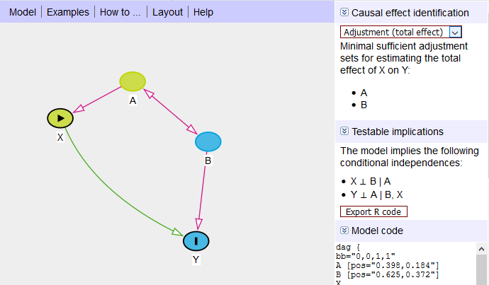

```{r setup, include=FALSE}
knitr::opts_chunk$set(echo = FALSE, warning=FALSE, message=FALSE)
library(tidyverse)
```

## Dagitty

- [Dagitty.net](http://www.dagitty.net) is a tool for building, drawing, and working with causal diagrams
- You can also work with dagitty in R directly with the `dagitty` and `ggdag` packages, although this is more difficult and we won't be covering it here

## Getting Started

Go to [Dagitty.net](http://www.dagitty.net) and click on "Launch Dagitty Online in your Browser"

There you'll see the main dagitty screen with three areas. On the left it has style options; we will be ignoring this for this basic introduction, although you may want to refer back to the Legend in the lower left-hand corner sometimes. In the middle you have the canvas to build your diagram on, and the menus. On the right it provides information about the causal diagram you've built.


\newpage

## Building a Diagram

In "Model" select "New Model". You will be presented with a blank canvas.

From there, you can add new variables by clicking (or tapping, on mobile) on an empty part of the diagram, and then giving the variable a name.

You can add arrows from `A` to `B` by first clicking on `A` and then clicking on `B`. You can remove an existing arrow in the same way. Once you have an arrow from `A` to `B`, you can create a double-headed arrow by clicking on `B` and then `A`.

If you click-and-drag on an arrow, you can make it curvy, which may help avoid overlaps in complex diagrams. Similarly, you can click-and-drag the variables themselves.


\newpage

## Variable Characteristics

Once you have some variables and arrows on your graph, you may want to manipulate them.

You can do this one of two ways: 

1. Clicking (or tapping on mobile) on the variable, and then looking for the "Variable" tab on the left (or below, on mobile).
2. Hovering over the variable and hitting a keyboard hotkey.


One thing you will probably want to do in almost *any* daggity graph is determine your **exposure/treatment** varible(s) (hotkey "e", or use the Variable tab) and your **outcome** variable (hotkey "o", or use the Variable tab).

Often, you will be using dagitty to attempt to identify the effect of an exposure variable on an outcome variable. Setting the exposure and outcome variables properly lets anyone looking at your graph know what it's for, and also lets dagitty do some nice calculations for you.

Other variable characteristics you might want to set:

1. Whether the variable is **observed in the data** (hotkey "u", or use the Variable tab). If a variable is not observed, you can't adjust for it. Let dagitty know it's not observed so it won't try to tell you to adjust for it!
2. Whether you've already **controlled/adjusted** for a variable (hotkey "a", or use the Variable tab). 

You may also want to re-work your diagram once you've made it. You can also **delete** variables (hotkey "d", or use the Variable tab), or **rename** them (hotkey "r", or use the Variable tab).

\newpage

## Using the Dagitty Diagnostics

The right bar of the screen contains lots of information about your diagram.

{width=90%}

At the top you'll see that it gives you the Minimal Adjustment Sets. Given the exposure variable you've set, and the outcome variable, it will tell you what you could control for to close all back doors. Here, you can identify `X -> Y` by controlling for `A` OR by controlling for `B` (`A` and `B` together would also work, but these are *minimal* adjustment sets - no unnecessary controls). 

Remember that the exposure and outcome variables must be set properly for this to work. It will also pay attention to the variables you've set to be unobserved, or the variables you've said you've already adjusted for.

If you select the "Adjustment (total effect)" dropdown you'll see that you can also set it to look for instrumental variables, or to look for the "direct effect". The direct effect looks *only* for `X -> Y`, and not counting for other front-door paths like `X -> C -> Y` (not pictured).

The diagram itself also has information. Any lines that are **purple** represent arrows that are a part of an open back door. Lines that are **green** are on a front door path / the causal effect of interest. And lines that are **black** are neither. In the graph we have here, we can see the green causal path of interest from `X` to `Y`, and a purple open back door path along `X <- A <-> B -> Y`. If you forget the colors, check the legend in the bottom-left.

The variables are marked too. The exposure and outcome variables are clearly marked. Green variables like `A` are ancestors of the exposure (they cause the exposure), and blue variables like `B` are ancestors of the outcome (they cause the outcome). Red variables are ancestors of both, and are likely on a back door path.

In the second panel on the right you can see the testable implications of the model. This shows you some relationships that *should* be there if your model is right. Here, that upside-down T means "not related to" and the | means "adjusting for". So, adjusting for `A`, `X` and `B` should be unrelated. And adjusting for both `B` and `X`, `A` and `Y` should be unrelated. You could test these yourself in data, and if you found they were related, you'd know the model was wrong.

\newpage

## Saving/Exporting Your Diagram

You can save your work using Model -> Publish. You'll need to save the code/URL you get so you can Model -> Load it back in later.

You can also export your graph for viewing using Model -> Export. However, keep in mind that dagitty tends to like to show the whole canvas, even if your model is only on a part of it. So you may want to be prepared to open the result in a photo editor to crop it after you've exported it. 

Another option for getting images of your models is to take a screenshot, cropped down to the area of your diagram. In Windows you can use the Snipping Tool (Windows Accessories -> Snipping Tool). On a Mac you can use Grab. 

